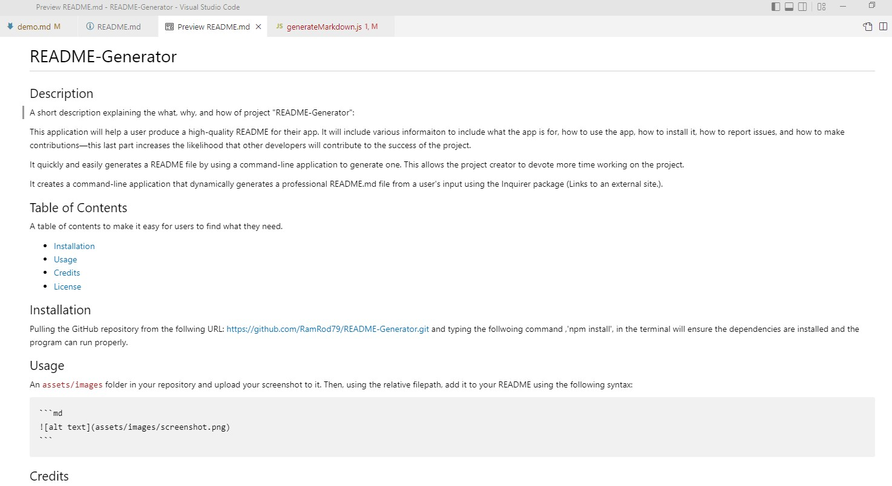

# README-Generator

## Description

A short description explaining the what, why, and how of project "README-Generator":

This application will help a user produce a high-quality README for their app. It will include various informaiton to include what the app is for, how to use the app, how to install it, how to report issues, and how to make contributions—this last part increases the likelihood that other developers will contribute to the success of the project.

It quickly and easily generates a README file by using a command-line application to generate one. This allows the project creator to devote more time working on the project.

It creates a command-line application that dynamically generates a professional README.md file from a user's input using the Inquirer package (Links to an external site.). 

## Table of Contents

A table of contents to make it easy for users to find what they need.

- [Installation](#installation)
- [Usage](#usage)
- [Credits](#credits)
- [License](#license)

## Installation

Pulling the GitHub repository from the follwing URL: https://github.com/RamRod79/README-Generator.git and typing the follwoing command ,'npm install', in the terminal will ensure the dependencies are installed and the program can run properly.

## Usage

## Credits

List of collaborators:

- UCLA Extension, Coding Bootcamp Instrucor and TAs

## License

The following licenses have been used in the development of this project:

${data.license}

## Badges

Badges aren't necessary, per se, but they demonstrate street cred. Badges let other developers know that you know what you're doing. Check out the badges hosted by [shields.io](https://shields.io/). You may not understand what they all represent now, but you will in time.

## Repo Features

Using this repo can be intitiated by running 'npm run Start' in the command terminal after opening the integrated terminal to initiate the program. Using this repo requires inquirer 8.2.4 or higher, and updated node modules to ensure application runs properly.

## How to Contribute

If other developers would like to contribute, you can contact me at armando.rod79@gmail.com.

## Tests

There are no tests required for this application at this time.

## Contact Info

For any other issues or comments please contact me at:

GitHub username: RamRod79

Email: armando.rod79@gmail.com